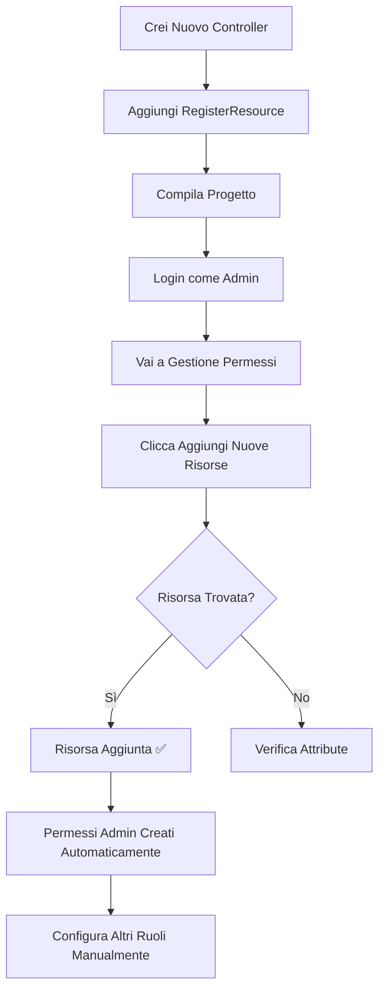

# 🎯 Sistema Ibrido di Gestione Risorse

## 📋 Panoramica

Il sistema di gestione permessi ora utilizza un **approccio ibrido** che combina:
- ✅ **Seed manuale** per le 33 risorse base (sicure e controllate)
- ✅ **Auto-discovery** per aggiungere nuove pagine in modo incrementale

---

## 🎨 I Due Pulsanti

### 1️⃣ **"Aggiungi Nuove Risorse"** (Verde) ✨
- **Icona**: ➕ Plus
- **Funzione**: Scansiona i controller con `[RegisterResource]` e aggiunge SOLO le risorse mancanti
- **Sicuro**: NON elimina nulla, è completamente incrementale
- **Quando usarlo**: Ogni volta che aggiungi una nuova pagina con `[RegisterResource]`

### 2️⃣ **"Reset e Re-seed"** (Arancione) ⚠️
- **Icona**: ⚠️ Warning
- **Funzione**: Elimina TUTTO e ricrea le 33 risorse base dal seed
- **Distruttivo**: Cancella tutte le risorse e i permessi personalizzati
- **Quando usarlo**: Solo in caso di problemi gravi o per tornare alla configurazione iniziale

---

## 🚀 Come Aggiungere una Nuova Pagina

### **Metodo Automatico (Consigliato)** ⭐

#### **Passo 1: Aggiungi l'Attribute al Controller**

```csharp
using AiDbMaster.Attributes;

[Authorize]
[RegisterResource(
    "Statistiche",                  // Nome univoco (uguale al controller senza "Controller")
    "Statistiche Avanzate",         // Nome visualizzato nel menu
    MenuIcon = "bi-bar-chart",      // Icona Bootstrap Icons
    MenuOrder = 10,                 // Ordine nel menu (relativo ai fratelli)
    ParentResourceId = 21           // ID del gruppo parent (vedi tabella sotto)
)]
public class StatisticheController : Controller
{
    // ...
}
```

#### **Passo 2: Clicca "Aggiungi Nuove Risorse"**

1. Salva e compila il progetto (`dotnet build`)
2. Login come **Admin**
3. Vai su **Amministrazione → Gestione Permessi**
4. Clicca il pulsante verde **"Aggiungi Nuove Risorse"**
5. ✅ La nuova risorsa apparirà automaticamente nella lista!

---

## 🗂️ ID dei Gruppi Parent

Usa questi ID per il `ParentResourceId`:

| Gruppo | ID | Descrizione |
|--------|-----|-------------|
| **Nessun parent (Root)** | `null` o `0` | Nuova voce root nel menu |
| **Tabelle** | `2` | Sotto il gruppo "Tabelle" |
| **Produzione** | `3` | Sotto il gruppo "Produzione" |
| **Interrogazioni DB** | `4` | Sotto il gruppo "Interrogazioni DB" |
| **Amministrazione** | `5` | Sotto il gruppo "Amministrazione" |

💡 **Tip**: Per scoprire gli ID esatti, vai sulla pagina Gestione Permessi e guarda la tabella delle risorse.

---

## 📝 Esempi Pratici

### **Esempio 1: Aggiungere "Report Vendite" sotto Interrogazioni DB**

```csharp
[RegisterResource(
    "ReportVendite", 
    "Report Vendite",
    MenuIcon = "bi-file-earmark-bar-graph",
    MenuOrder = 6,          // Dopo InterrogazioniAI (che è 5)
    ParentResourceId = 4    // InterrogazioniDB
)]
public class ReportVenditeController : Controller
{
    // ...
}
```

### **Esempio 2: Aggiungere "Backup Database" sotto Amministrazione**

```csharp
[RegisterResource(
    "BackupDatabase", 
    "Backup Database",
    MenuIcon = "bi-database-fill-down",
    MenuOrder = 7,          // Dopo SyncfusionTest (che è 6)
    ParentResourceId = 5    // Amministrazione
)]
public class BackupDatabaseController : Controller
{
    // ...
}
```

### **Esempio 3: Aggiungere un Nuovo Gruppo Root**

```csharp
[RegisterResource(
    "Marketing", 
    "Marketing",
    MenuIcon = "bi-megaphone",
    MenuOrder = 6,          // Dopo Amministrazione
    ParentResourceId = 0,   // Root (nessun parent)
    IsMenuGroup = true      // È un gruppo, non una pagina
)]
public class MarketingController : Controller
{
    // Questo controller non fa nulla, è solo un gruppo menu
}
```

---

## 🔄 Flusso di Lavoro Completo



---

## 🎯 Vantaggi del Sistema Ibrido

### ✅ **Vantaggi**

1. **Sicurezza Iniziale**: Le 33 risorse base sono sempre stabili e controllate
2. **Flessibilità**: Puoi aggiungere nuove pagine senza modificare il seed
3. **Nessun Conflitto**: "Aggiungi Nuove" non tocca le risorse esistenti
4. **Rapido**: Aggiungi una pagina in 2 minuti
5. **Documentazione**: `[RegisterResource]` documenta la struttura del menu nel codice
6. **Reset Sicuro**: Puoi sempre tornare al set base con "Reset e Re-seed"

### ⚠️ **Limitazioni**

1. Devi ricordare l'ID del parent (ma è documentato sopra)
2. Se cambi gli ID con un reset, gli attribute potrebbero avere ID sbagliati
3. Devi sempre compilare prima di cliccare "Aggiungi Nuove"

---

## 🔧 Troubleshooting

### **Problema: "Nessuna nuova risorsa da aggiungere"**

**Causa**: Il controller:
- Non ha l'attribute `[RegisterResource]`
- Ha lo stesso `Name` di una risorsa esistente
- Non è stato compilato

**Soluzione**:
1. Verifica che l'attribute sia corretto
2. Compila il progetto
3. Riprova

---

### **Problema: "Parent Resource ID non trovato"**

**Causa**: Il `ParentResourceId` nell'attribute non esiste nel database

**Soluzione**:
1. Controlla la tabella nella pagina Gestione Permessi per vedere gli ID reali
2. Usa gli ID corretti:
   - Tabelle = 2
   - Produzione = 3
   - Interrogazioni DB = 4
   - Amministrazione = 5

---

### **Problema: La nuova risorsa non appare nel menu**

**Causa**: Probabilmente:
- Manca il permesso View per il tuo ruolo
- Il menu non si aggiorna automaticamente

**Soluzione**:
1. Vai su Gestione Permessi
2. Seleziona il tuo ruolo
3. Attiva il permesso "View" per la nuova risorsa
4. Fai logout/login per ricaricare i permessi

---

## 📊 Stato Controller Esistenti

Attualmente **solo 3 controller** hanno `[RegisterResource]`:
- ✅ `AnagraficaArticoliController`
- ✅ `AnagraficaClientiController`
- ✅ `AnagraficaFornitoriController`

Tutti gli altri 30 controller **non hanno** l'attribute, ma sono comunque nel seed manuale.

💡 **Puoi aggiungere l'attribute agli altri controller** se vuoi documentare meglio la struttura, ma **non è necessario** per il funzionamento attuale.

---

## 🎉 Conclusione

Con questo sistema ibrido hai il meglio dei due mondi:
- 🔒 **Stabilità**: Set base di 33 risorse sempre disponibili
- 🚀 **Flessibilità**: Aggiungi nuove pagine in pochi minuti
- ✅ **Sicurezza**: Approccio incrementale senza rischi
- 📝 **Documentazione**: Codice auto-documentato con attribute

**Prossimi passi suggeriti:**
1. Esegui il "Reset e Re-seed" per avere le 33 risorse base
2. Configura i permessi per i vari ruoli
3. Prova ad aggiungere una nuova pagina di test

---

**Data creazione:** 17 Novembre 2024  
**Versione:** 2.0 (Sistema Ibrido)  
**Autore:** AI Assistant

